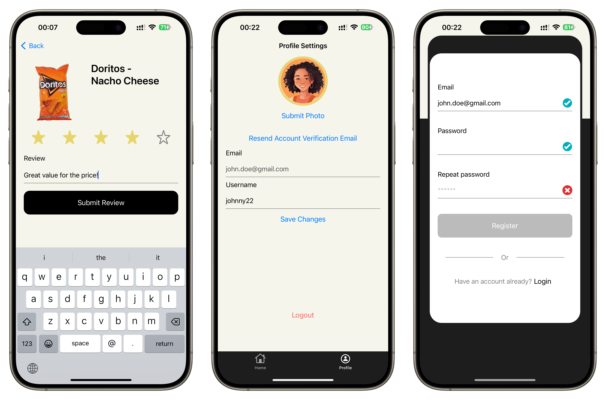

# RecenziRAJ 😇

**RecenziRAJ** is an iOS mobile app that merges machine learning and cloud services to provide users with an efficient platform for grocery store item recognition and review. The app's name is a play on the Croatian word **"Recenziraj"** (meaning "review") which contains the word **"Raj"** (meaning "heaven"), creating a metaphor for a **"Review Heaven"** – a space where users can effortlessly review and rate grocery items.

## Key Features

### 🍎 Machine Learning with CoreML for Item Detection
RecenziRAJ leverages a **CoreML**-powered machine learning model for **on-device image recognition**. The model is trained to detect and classify **50 different grocery store items** without the need for network access, ensuring real-time performance and privacy.
- **Local Model**: The CoreML model is bundled within the app, allowing fast inference.
- **Efficient Processing**: No API calls or cloud resources are used for image recognition, reducing latency and ensuring offline functionality.

### 📸 Review and Rating System
Once the item is identified, users can engage with the product by writing **reviews** and assigning **ratings**. Each review consists of:

- **Textual feedback** on the grocery item
- A **star rating system** (1–5 stars)

### 🔐 Firebase Authentication (AUTH)
User profiles are managed via **Firebase Authentication**, allowing secure and scalable user management. Users can sign up and log in using:
- Email and password authentication

### ☁️ Firebase Storage and Database
RecenziRAJ supports profile customization, where users can upload a profile picture. These images are securely stored using **Firebase Storage**, ensuring persistent and scalable media handling.
- Profile images are uploaded, stored, and served efficiently from the cloud.
- Seamless integration with user profiles through Firebase’s SDKs.

All user reviews and ratings are stored in **Firebase Realtime Database**, enabling secure, real-time updates across devices. The database handles the following:
- Storing structured data, including user reviews and item ratings.
- Syncing changes instantly for all users, allowing the community to access reviews in real time.

## Screenshots

---

## App Workflow
1. **User Authentication**: Users authenticate via Firebase AUTH and creates a profile.
2. **Image Capture**: Users capture a grocery store item using their camera.
3. **Item Recognition**: The app processes the image using CoreML, identifying the item locally.
4. **Review & Rating**: Users submit a review and star rating for the recognized item.
5. **Data Storage**: Reviews are sent to Firebase Realtime Database and synced across the app, while profile images are stored in Firebase Storage.

## Tech Stack Overview
| Component              | Technology               | Description |
|------------------------|--------------------------|-------------|
| **Machine Learning**    | **CoreML**                | Local ML model for item recognition |
| **Authentication**      | **Firebase Authentication** | Secure user sign-up and login (email/password) |
| **Storage**             | **Firebase Storage**      | Storing user profile images |
| **Database**            | **Firebase Realtime Database** | Storing and syncing reviews and ratings |
| **Frontend**            | **Swift (iOS)**           | iOS app development leveraging UIKit, CoreML and the Firebase SDK |
